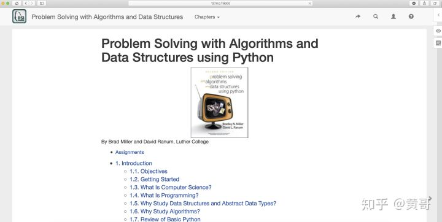

# 黄哥Python: 在本地看数据结构和算法书

按照下面这样做，可以像我一样，在本地看

《Problem Solving with Algorithms and Data Structures using Python》这本电子书




第一步：git clone 到本地

git clone [https://github.com/RunestoneInteractive/pythonds](https://link.zhihu.com/?target=https%3A//github.com/RunestoneInteractive/pythonds)

第二步：安装库

pip install -r requirements.txt

第三步： 生成html 文件

```
runestone build
```

will build the html and put it in `./build/pythonds`

第四步：runestone serve

will start a webserver and serve the pages locally from `./build/pythonds`

第五步： 在浏览器输入127.0.0.1:8000, 就可以浏览该书的内容。

[黄哥Python:提醒要转行当程序员的朋友,学习要分先后主次](https://github.com/pythonpeixun/article/blob/master/2019/learninghaspriority.md)