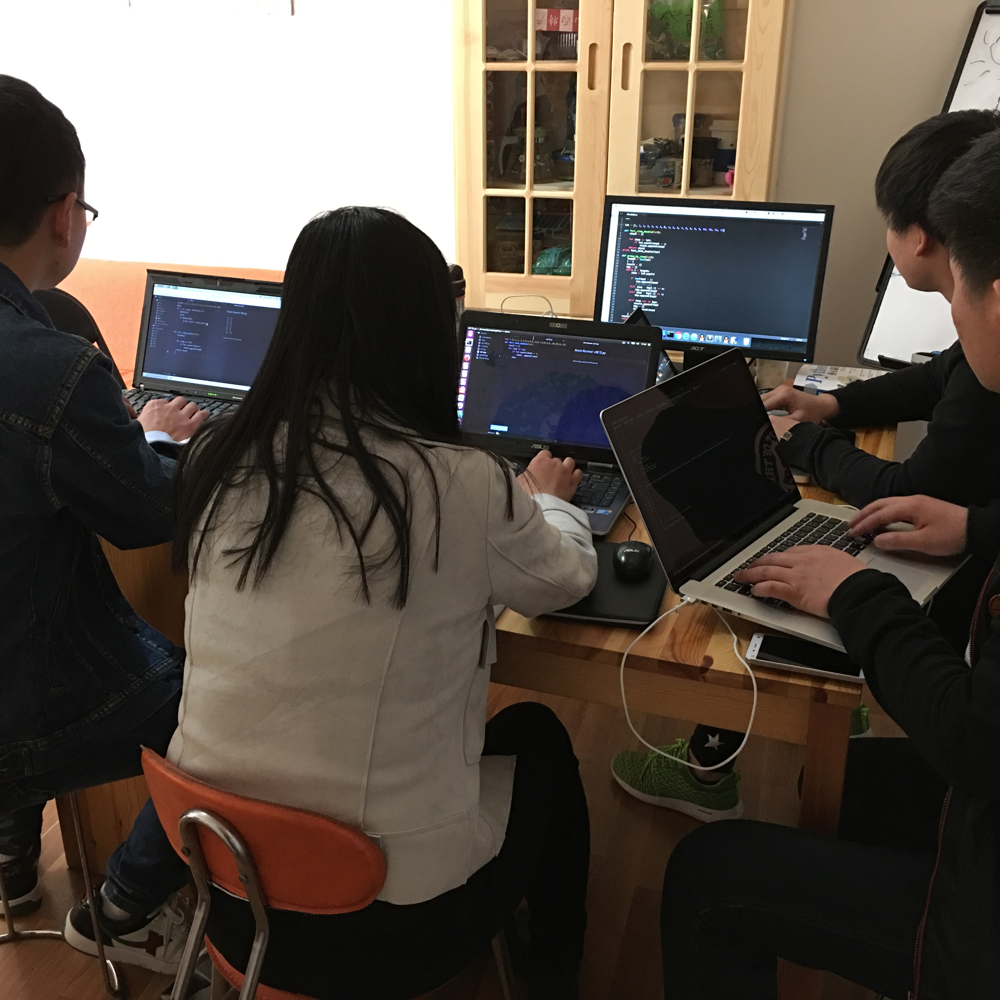
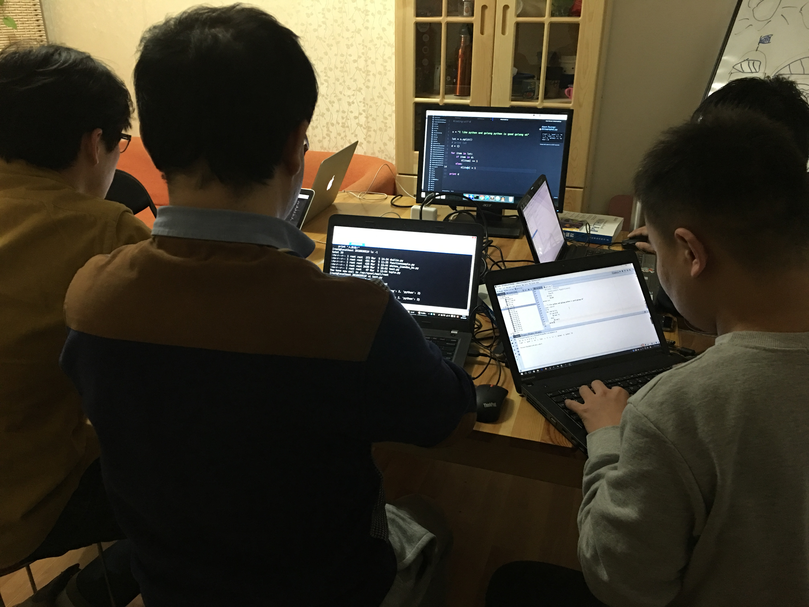

# 2017年黄哥python深圳周末培训班第一期招生

# 面授时间：4月22-23 29-30 四天面授 + 1年答疑服务的视频培训 
#价格：8800元
#地点：待定
##报名方式：请将姓名 + 电话 + qq号码 + 所在城市 + 职业（根据自己的情况写，运维、测试、软件开发或学生） 发邮件到：1465376564@qq.com

#培训内容请看[黄哥python远程视频培训班](https://github.com/pythonpeixun/article/blob/master/index.md)

#咨询:qq:1465376564 电话：18610508486 黄老师

#2016年黄哥python北京周末培训班第四期招生
##第四期开课时间：2016年6月12起 已经完美完成！

##第三期开课时间：2016年5月14起 已经完美完成！

##第二期开课时间：2016年3月27起 已经完美完成！

##第一期开课时间：2016年2月27起 已经完美完成！

##学习周期：连续2个月周末，每周上课1天（每天课时8到10小时）。

##报名方式：请将姓名 + 电话 + qq号码 + 所在城市 + 职业（根据自己的情况写，运维、测试、软件开发或学生） 发邮件到：1465376564@qq.com

## 上课地址：北京石景山
#培训内容请看[黄哥python远程视频培训班](https://github.com/pythonpeixun/article/blob/master/index.md)

#费用：  面授6800 元

#咨询:qq:1465376564 电话：18610508486 黄老师

#[点击黄哥python培训试看视频播放地址](https://github.com/pythonpeixun/article/blob/master/python_shiping.md)
