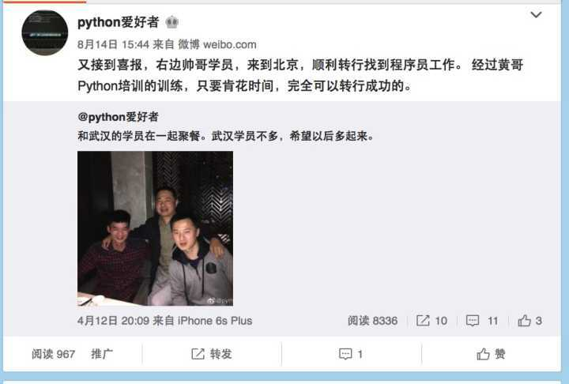
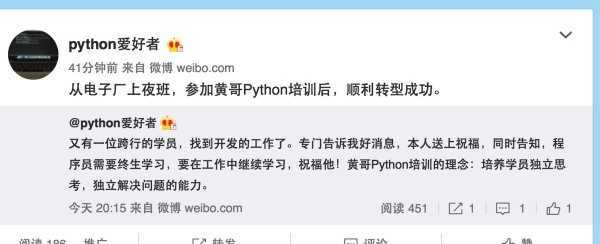
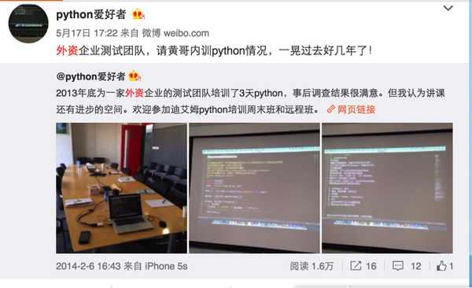
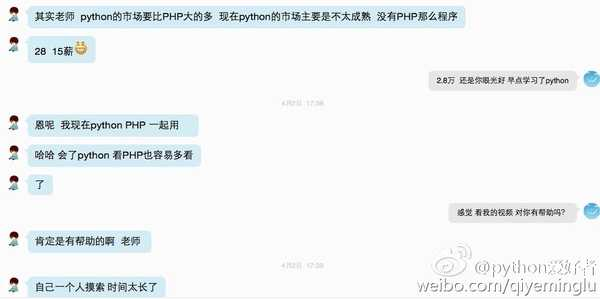
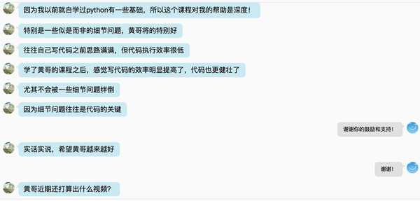
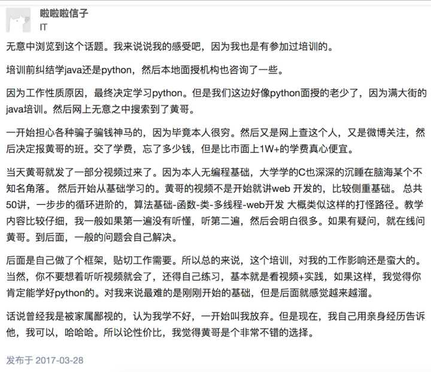
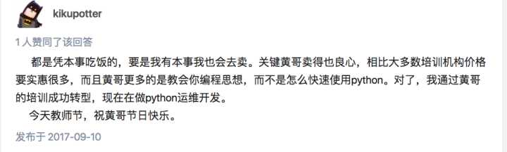
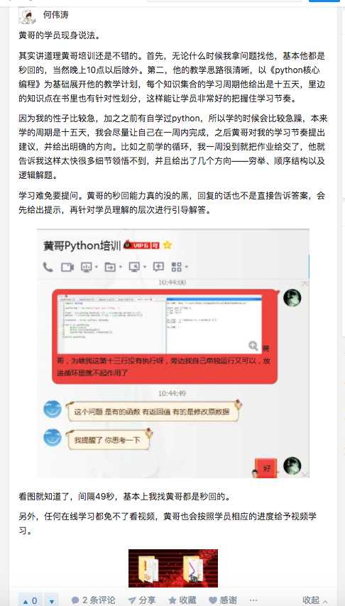

# 2017 年即将过去，黄哥对自己做一个全面的介绍    

黄哥，这个名字是怎么来的，因为黄哥姓黄，在北京生活，北方习惯叫哥和姐的，所以也很

世俗的自称哥。

## 1、黄哥毕业于北交大，生活在北京，有破房一套，破车一辆，但有一颗上进的心。

	黄哥的价值观，帮助他人，也是帮助自己。

	对待学习编程的态度，是能自学，就自学，自学搞不定的，欢迎联系黄哥。

	初中学历，高中学历并且年龄32岁以上的朋友，转程序员要慎重！

	黄哥新录制的视频：谈转行当程序员的事

	黄哥培训的目标，培养学员养成独立思考，独立解决问题的能力，帮你完成从0到1的转换。

## 2、黄哥能力问题

	黄哥不吹牛，也不是特牛逼的程序员（不然也在bta拿年薪百万，人贵有自知之明，黄哥也在不断学习中。）
	但黄哥能帮助学员快速的完成0到1（从零基础到自己会写代码解决问题。）的这个过程。黄哥如果没有一定的水平，企业不可能请我去讲课，
	黄哥教会完全小白通过学习Python学会编程一点问题没有。
	特别提示：外出讲课不是那么好讲的，有的企业听课者达上百人，各种技术背景的都有，讲不好课，会被轰下台。
	每次讲完课，有一个调查表，要填写满意度，如果低于一个约定的满意度，是拿不到讲课费的。
	黄哥每次顺利拿到讲课费。欢迎提供内训的公司，邀请黄哥去为你的客户服务。

	
	

	2013年北京外资企业请我讲课的情况

	

	照片为黄哥本人，为四川知名企业提供内训，摄于2016年9月，成都天府四街。

    

    
## 3、很多学员在黄哥的训练下顺利学会编程，下面是一些学员对黄哥的真实评价。

	下面的图片，黄哥对天发誓，如有造假，必遭天谴！

	年薪42万的运维学员。
    

	东北学员评价

    

	深圳测试女测试学员的评价

	
	运维学员的评价

	

	

## 4、网上有那么几个小人，对他们的言语，本人表示不接收，做人不要太嚣张，总有你哭的那么一天。

## 5、黄哥本人每天花大量时间为网友免费答疑，是有证据可查的。

[黄哥知乎答疑集](https://www.zhihu.com/people/pythonpeixun/answers)

## 请看黄老师本人写的文章  

[如何捅破python编程的那层纸]
(https://github.com/pythonpeixun/article/blob/master/pythonstudy.md)

[剪刀石头布小习题三种语言python2、php、go代码]
(https://github.com/pythonpeixun/article/blob/master/jdstb.md)  

[一段小代码说明@property装饰器的用法]
(http://my.oschina.net/pythonpeixun/blog/382586)

[如何捅破python编程的那层纸之二]
(http://www.oschina.net/code/snippet_1448389_49635)

[如何捅破python编程的那层纸之三]
(http://www.oschina.net/code/snippet_1448389_49691)

[黄哥python试看视频播放地址]
(https://github.com/pythonpeixun/article/blob/master/python_shiping.md)  

[python初学的第一步]
(http://www.tudou.com/programs/view/pZvrOt9RlmE/)

[如何捅破python编程的那层纸视频]
(http://www.tudou.com/programs/view/ppJv6Kf08Ac/)
