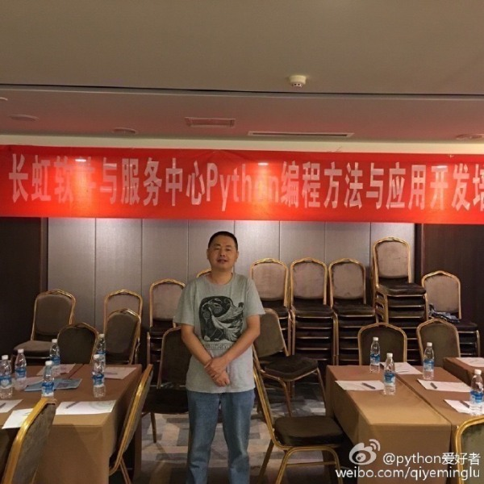
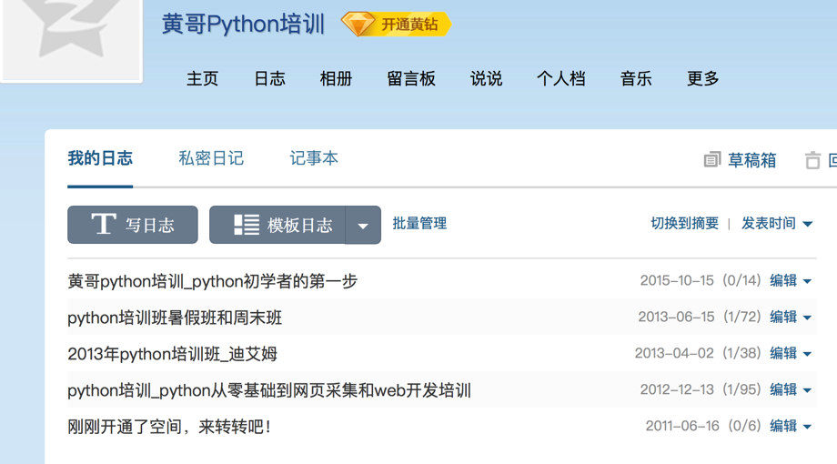
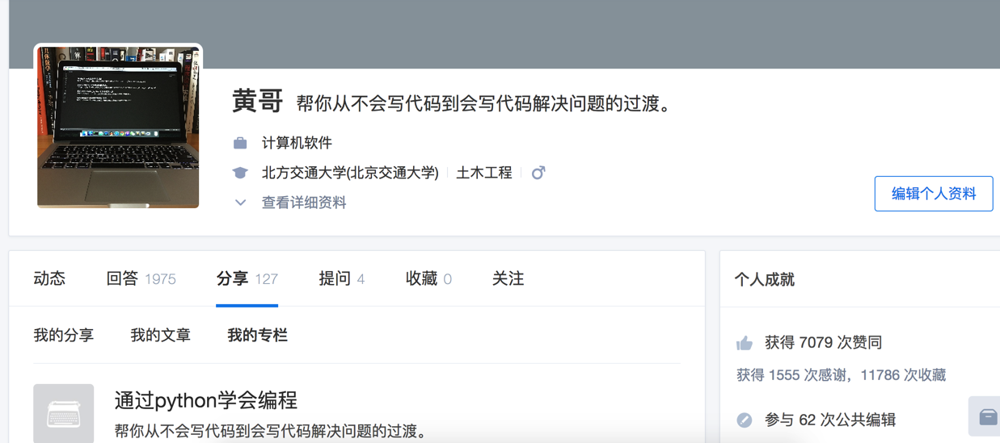

# 黄哥python远程视频培训班

##特别提示：    

	2017年全新出发，只为有缘的朋友提供服务，扭扭捏捏，叶公好龙者，
	请请不要参加这个培训。
	不喜欢做题，不喜欢动脑，不喜欢敲代码。请不要参加这个培训。

## 形式：自己看视频+作业+答疑，利用业余时间学习。视频50讲，视频中详细的讲解解题思路，课后大量习题

训练学员自己写代码，通过训练达到不光能看懂代码，而且能自己写代码的目的。

# 目标：

第一目标是：通过学习python学会编程 。  

第二目标：会写爬虫，网页采集。  

第三目标：学会web开发。

学习周期：三个月到6个月。

咨询:qq:1465376564 黄老师。

目标： 通过学习python来到达学会编程的目的。  


# 面向过程编程训练

1、变量，表达式，语句。  

2、常用的数据结构：list,tuple,set,字典。

3、顺序结构、判断结构、循环结构(if判断 for while 循环) 。

4、文本文件读写，利用if语句和while循环将采集的有一定规律的文本处理成有规律文本，导入到mysql。  

以上重点是：逻辑思维的训练，多重循环在文本处理中的应用。

5、python和数据库编程。


# 函数抽象和类抽象训练   


## 6、函数,异常,类

- 展开来讲类和实例，类属性和实例属性，构造函数__new__和__init__方法，析构函数__del__()。

- 调用绑定方法和 非绑定方法，静态方法和类方法。

- 类封装性(数据隐藏)，类继承,重载，运算符重载等，最后怎么样用面向对象的思想来编写代码。)，

  进程、多线程，递归等。

- 迭代器，生成器精讲。

- 闭包、装饰器精讲、类的属性精讲(@property，__getattr__,__setattr__,__getattribute__，__slots__等特殊应用)。

## 7、网络编程，urllib2的使用，正则表达式，字符处理,utf-8和gb2312互换。群发邮件如何实现。


## 8、爬虫(采集网页)实战  


*模拟post,get.汉字乱码的处理。  


*网页自动翻页，自动点击。  
（可以用在测试自动化上。））

### 以上重点：是正则表达式的运用。还有是网页规律查找，利用工具拦截post,get的参数。


## 9、模块和包


10、数据结构和算法初步训练：穷举法、递推法，二分法查找，排序等训练。


## 11、 web开发：

先从简单的web.py开发为例，分页,表单提交，修改，删除。用户注册，认证,验证码,注册用户邮件激活，文章评论，后台管理等。


django开发。  

## 12、python图形界面编程。

## 13、python-PIL图像编程

## 14、python-pygame游戏编程简介。

## 15、python调试和测试。

## python调试

python测试:doctest和UnitTest

## 16、python和运维。

Paramiko和fabric等的应用。

## 案例：


1、群发邮件系统的实现.  

2、网页采集实战    

3、在线黄页查询实现。（web.py实现完整网站）    

4、django,web开发实战（分页，查询，用户注册，登陆，退出，文章评论，后台管理等）。  




## 教材：


Python 核心编程 第二版

## 提供培训形式：  
 视频+作业+答疑。





## 费用：  6800元  （专业程序员为学员服务6个月，答疑可以延长到1年，何贵之有！学习英文需要几万，这个大家都知道吧！）

## *咨询:qq:1465376564 电话：18610508486 黄老师*

## [点击黄哥python培训试看视频播放地址](https://github.com/pythonpeixun/article/blob/master/python_shiping.md)

## 有一些朋友对课程的顾虑问题。
1、黄哥有10多年开发经验，被多家企业邀请去内训，如果没有水平，企业不可能请我去讲课。
   2013年外资企业测试团队请我讲课的情况。
   

下面照片为黄哥本人，为四川知名企业提供内训，摄于2016年9月，成都天府四街。

2、信誉问题    

  请看图片，黄哥qq空间，2012-12-13开始从事Python培训。
  

  黄哥微博有几千粉丝
  

  知乎有几千专注者
  
  
  上面的信息都是真实存在，大家都可以查看。

3、几个问题    
   （1）上视频培训，还是上面授的问题。    

   [参加编程培训(Python、Java)面授到底值不值？](https://pythonpeixun.github.io/2017/01/06/%E9%9D%A2%E6%8E%88%E5%88%B0%E5%BA%95%E5%80%BC%E4%B8%8D%E5%80%BC/)

   （2）答疑由黄哥亲自答疑，有的朋友疑问是能服务得过来吗？    
       黄哥的回答是：一般都能及时回复，不能及时回复的，24小时内回复。
       学员提问不是同一时间提问，所以不存在答疑的问题。

    (3) 请看学员的评价    
    [感恩！感谢黄哥Python培训学员的支持和肯定。](https://github.com/pythonpeixun/article/blob/master/python/thanks.md)
    

