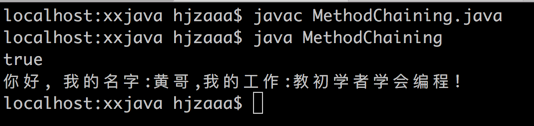

# Java 模仿Python 方法链代码

[跟黄哥学python序列文章之python方法链(method chaining)](https://github.com/pythonpeixun/article/blob/master/python/pythonmethodchaining.md)

得到很多朋友的喜欢。

下面是Java代码，模仿Python的代码所写。

文件名为 MethodChaining.java

		public class MethodChaining {
		  public static void main(String[] args){
		    MyClass p = new MyClass();
		    System.out.println(p.setName("hjz") == p);
		    p.setName("黄哥").introduce();
		  }
		}

		class MyClass {
		  public String name;
		   public MyClass setName(String value){
		     this.name = value;
		     return this;
		   }
		   public void introduce(){
		      System.out.println("你好, 我的名字:" + this.name + ",我的工作:" + "教初学者学会编程!");
		   }

}
在mac 下代码所在的目录，javac MethodChaining.java

运行 java MethodChaining

输出结果：