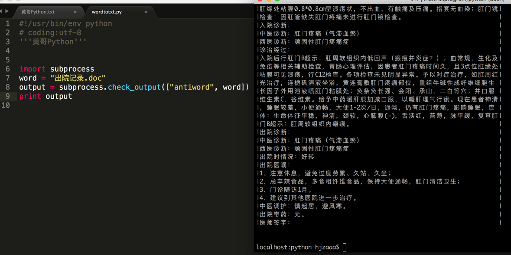

# Python 抽取word文档中的文本。

## 引言
   一个付费答疑的会员，咨询我如何将word文档中的文本用Python抽取。
   在一个星期前问我，因为本人没有处理过这个问题，搜到一些解决方案给他。
   1、[python-docx](http://python-docx.readthedocs.io/en/latest/user/documents.html)
   2、windows下的win32com
   python-docx 只能处理docx的文件，他的word文件是doc格式。
   win32com,他没有搞定，我没有windows，也没有打算用这个库。
   本来答疑没有帮助写代码的服务，但他搞一个星期没有搞定，黄哥基于职业道德，
   来帮助他搞定这个事。

## 下面来分享一下是怎么在10分钟内搞定他一个星期搞不定的问题。

    归功于google 和独立思考，既然现有的库只支持docx文档，那么我就思考，linux下有不有工具软件
    处理这个事情，搜索一下，还真找到了这个[antiword](http://www.winfield.demon.nl)
    在mac下brew install antiword
    安装后再在终端antiword 出院记录.doc 文件，文本输出了，到这里就有谱了。

## Python 代码就只有几行。

	#!/usr/bin/env python
	# coding:utf-8
	'''黄哥Python'''
	
	import subprocess
	word = "出院记录.doc"
	output = subprocess.check_output(["antiword", word])
	print output

## 总结
   程序员要养成独立解决问题的习惯，快速利用google解决问题的能力。

[如何训练自己的编程思路](https://github.com/pythonpeixun/article/blob/master/python/how_to_learn_program2.md)

[部分免费Python免费视频](https://github.com/pythonpeixun/article/blob/master/python_shiping.md)

[感恩！感谢黄哥Python培训学员的支持和肯定](https://zhuanlan.zhihu.com/p/21548489?refer=pythonpx)
