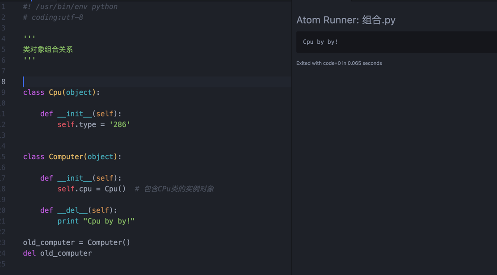
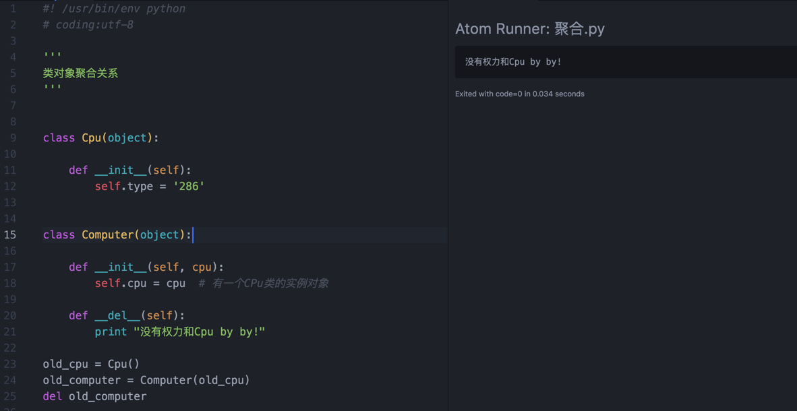

# Python 类组合(composition)和聚合(aggregation)

[从下面一段代码开始说起，知乎上有人问这个问题，说代码看不懂。](https://www.zhihu.com/question/49398036)

		#coding:utf-8
		#书中一个例子简单的短期利率类，折现是金融学中最基本的概念之一，在连续折现的固定短期利率世界中，日期t>0时未来现金流与当前日期t=0之间的折现因子为Do(t)=e（-rt）次方

		import numpy as np

		class short_rate(object):
		    def __init__(self,name,rate):
		        self.name=name
		        self.rate=rate
		    def get_discount_factors(self,time_list):
		        time_list=np.array(time_list)
		        return np.exp(-self.rate*time_list)

		class cash_flow_series(object):
		    def __init__(self,name,time_list,cash_flows,short_rate):
		        self.name=name
		        self.time_list=time_list
		        self.cash_flows=cash_flows
		        self.short_rate=short_rate
		    def present_value_list(self):
		        df = self.short_rate.get_discount_factors(self.time_list)#想问这一行中为什么可以这样子不继承第一个类可以调用第一个类的函数呢
		        return np.array(self.cash_flows)*df
		    def net_present_value(self):
		        return np.sum(self.present_value_list())

		class cfs_sensitivity(cash_flow_series):
		    def npv_sensitivity(self,short_rates):
		        npvs=[]
		        for rate in short_rates:
		            sr.rate=rate #这个实例化rate的意思是？
		            npvs.append(self.net_present_value())
		        return np.array(npvs)

		short_rates=[0.01,0.025,0.05,0.075,0.1,0.125,0.15,0.2]
		cash_flows=np.array([-100,50,75])
		time_list=[0.0,1.0,2.0]

		sr=short_rate('r',0.05)

		print sr.get_discount_factors(time_list)

		sr.rate=0.05
		cfs=cash_flow_series('cfs0',time_list,cash_flows,sr)
		print cfs.present_value_list()

		cfs_sens=cfs_sensitivity('cfs',time_list,cash_flows,sr)

		npvs=cfs_sens.npv_sensitivity(short_rates)

		print npvs

上面的代码命名很糟糕，提问者说是书Python金融大数据分析 (豆瓣)   P350页上的代码。
稍微修改一下

		# coding:utf-8
		# 书中一个例子简单的短期利率类，折现是金融学中最基本的概念之一，在连续折现的固定短期利率世界中，日期t>0时未来现金流与当前日期t=0之间的折现因子为Do(t)=e（-rt）次方

		import numpy as np

		class ShortRate(object):

		    def __init__(self, name, rate):
		        self.name = name
		        self.rate = rate

		    def get_discount_factors(self, time_list):
		        time_list = np.array(time_list)
		        return np.exp(-self.rate * time_list)

		class CashFlowSeries(object):

		    def __init__(self, name, time_list, cash_flows, short_rate):
		        self.name = name
		        self.time_list = time_list
		        self.cash_flows = cash_flows
		        self.short_rate = short_rate

		    def present_value_list(self):
		        df = self.short_rate.get_discount_factors(
		            self.time_list)  # 想问这一行中为什么可以这样子不继承第一个类可以调用第一个类的函数呢
		        return np.array(self.cash_flows) * df

		    def net_present_value(self):
		        return np.sum(self.present_value_list())

		class CfsSensitivity(CashFlowSeries):

		    def npv_sensitivity(self, ShortRates):
		        npvs = []
		        for rate in ShortRates:
		            sr.rate = rate  # 这个实例化rate的意思是？
		            npvs.append(self.net_present_value())
		        return np.array(npvs)

		ShortRates = [0.01, 0.025, 0.05, 0.075, 0.1, 0.125, 0.15, 0.2]
		cash_flows = np.array([-100, 50, 75])
		time_list = [0.0, 1.0, 2.0]

		sr = ShortRate('r', 0.05)

		print sr.get_discount_factors(time_list)

		sr.rate = 0.05
		cfs = CashFlowSeries('cfs0', time_list, cash_flows, sr)
		print cfs.present_value_list()

		cfs_sens = CfsSensitivity('cfs', time_list, cash_flows, sr)

		npvs = cfs_sens.npv_sensitivity(ShortRates)

		print npvs

提问者提出其中df = self.short_rate.get_discount_factors(self.time_list) 这条语句不是很明白。

	1、这个一个面向对象中类聚合的概念。
	2、需要看CashFlowSeries 类的初始化方法中 self.short_rate = short_rate
	short_rate 是ShortRate 类的实例，但你的代码命名有问题，ShortRate 的实例调用自己的实例方法，没有问题。

	3、sr.rate = rate # 这个实例化rate的意思是？ 
	要从下面语句看，sr 就是下面的sr 这个sr 是ShortRate的实例。sr 有实例属性rate.
	sr.rate = 0.05
	cfs = CashFlowSeries('cfs0', time_list, cash_flows, sr)

类之间有多种关系，请大家看[维基百科,类别图](https://wikipedia.kfd.me/zh-cn/%E9%A1%9E%E5%88%A5%E5%9C%96)
下面主要介绍聚合(Aggregation)以及组合(Composition)。

聚合(aggregation)：指的是整体与部分的关系。通常在定义一个整体类后，再去分析这个整体类的组成结构。从而找出一些组成类，该整体类和组成类之间就形成了聚合关系。需求描述中“包含”、“组成”、“分为…部分”等词常意味着聚合关系。
 
组合(composition)：也表示类之间整体和部分的关系，但是组合关系中部分和整体具有统一的生存期。一旦整体对象不存在，部分对象也将不存在。部分对象与整体对象之间具有共生死的关系。

请看下面的代码。类组合，Computer实例对象不存在了，内部组合的Cpu实例也不存在。聚合Computer实例对象不存在了，从初始化方法传入的Cpu实例不属Computer实例对象存在不存在的影响。

	#! /usr/bin/env python
	# coding:utf-8

	'''
	类对象组合关系
	'''

	class Cpu(object):

	    def __init__(self):
	        self.type = '286'

	class Computer(object):

	    def __init__(self):
	        self.cpu = Cpu()  # 包含CPu类的实例对象

	    def __del__(self):
	        print "Cpu by by!"

	old_computer = Computer()
	del old_computer

	#! /usr/bin/env python
	# coding:utf-8

	'''
	类对象聚合关系
	'''

	class Cpu(object):

	    def __init__(self):
	        self.type = '286'

	class Computer(object):

	    def __init__(self, cpu):
	        self.cpu = cpu  # 有一个CPu类的实例对象

	    def __del__(self):
	        print "没有权力和Cpu by by!"

	old_cpu = Cpu()
	old_computer = Computer(old_cpu)
	del old_computer

[216小时学会Python](https://github.com/pythonpeixun/article/blob/master/python/hours_216.md)    
[点击黄哥python培训试看视频播放地址](https://github.com/pythonpeixun/article/blob/master/python_shiping.md)

