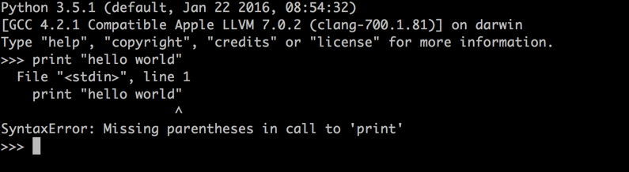
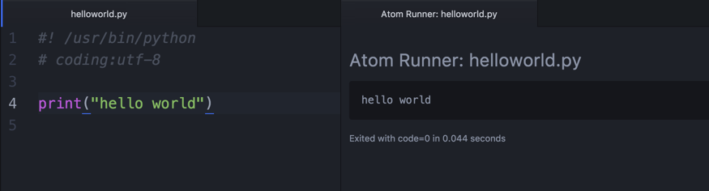

# 跟黄哥学习python第二章

## 为啥你看了很多书，很多免费视频，还是不能自己写代码。
	学习编程不能只学习语法，看一些照着PPT念，夸夸其谈的只讲语法的视频，
	这是你还不能自己写代码的原因。
	学习编程要学习解决问题的方法，学习算法，学习编程思路。

# 何为算法

	在数学和计算机科学之中，算法为一个计算的具体步骤，常用于计算、数据处理和自动推理。  
	精确而言，算法是一个表示为有限长列表的有效方法。算法应包含清晰定义的指令用于计算函数 。   
	算法中的指令描述的是一个计算，当其运行时能从一个初始状态和初始输入开始， 经过一系列有限   而清晰定义的状态最终产生输出 并停止于一个终态。
	一个状态到另一个状态的转移不一定是确定的。    
	随机化算法在内的一些算法，包含了一些随机输入。 
	形式化算法的概念部分源自尝试解决希尔伯特提出的判定问题，
	并在其后尝试定义有效计算性或者有效方法中成形。  

	--来自维基百科

# 计算思维   

		计算思维（Computational Thinking）概念的提出是计算机学科发展的自然产物。
		第一次明确使用这一概念的是美国卡内基·梅隆大学周以真（Jeannette M. Wing）教授。
		计算思维是运用计算机科学的基础概念去求解问题、设计系统和理解人类的行为；
		计算思维最根本的内容，即其本质是抽象和自动化。

		2006年3月，美国卡内基·梅隆大学计算机科学系主任周以真（Jeannette M. Wing）教授在美国计算机权威期刊《Communications of the ACM》杂志上给出，
		并定义的计算思维（Computational Thinking）。
		周教授认为：计算思维是运用计算机科学的基础概念进行问题求解、系统设计、以及人类行为理解等涵盖计算机科学之广度的一系列思维活动。

		以上是关于计算思维的一个总定义，周教授为了让人们更易于理解，又将它更进一步地定义为：
		通过约简、嵌入、转化和仿真等方法，把一个看来困难的问题重新阐释成一个我们知道问题怎样解决的方法；
		是一种递归思维，是一种并行处理，是一种把代码译成数据又能把数据译成代码，
		是一种多维分析推广的类型检查方法；
		是一种采用抽象和分解来控制庞杂的任务或进行巨大复杂系统设计的方法，是基于关注分离的方法（SoC方法）；  
		是一种选择合适的方式去陈述一个问题，或对一个问题的相关方面建模使其易于处理的思维方法；
		是按照预防、保护及通过冗余、容错、纠错的方式，并从最坏情况进行系统恢复的一种思维方法；
		是利用启发式推理寻求解答，也即在不确定情况下的规划、学习和调度的思维方法；
		是利用海量数据来加快计算，在时间和空间之间，在处理能力和存储容量之间进行折衷的思维方法。

# 何为程序设计

	计算机程序设计（英语：Computer programming），或称程序设计（programming），是给出解决特定问题程序的过程，软件开发过程中的重要步骤。
	程序设计往往以某种程序设计语言为工具，给出这种语言下的程序。程序设计过程应包括分析、设计、编码、测试、除错等不同阶段。
	在计算机技术发展的早期，软件开发主要就是程序设计。但随着技术的发展，软件系统越来越复杂，逐渐分化出许多专用的软件系统，如操作系统、数据库系统、应用服务器，而且这些专用的软件系统愈来愈成为普遍的系统环境的一部分。这种情况下软件开发的内容越来越丰富，不再只是纯粹的程序设计，还包括数据库设计、用户界面设计、通信协议设计和复杂的系统配置过程。
	专业的程序设计人员被称为程序员。某种意义上，程序设计的出现甚至早于电子计算机的出现。英国著名诗人拜伦的女儿爱达·勒芙蕾丝曾设计了巴贝奇分析机上计算伯努利数的一个程序。她甚至还创建了循环和子程序的概念。由于她在程序设计上的突破性创新，爱达·勒芙蕾丝被称为世界上第一位程序员。
	任何设计工作都是在各种条件限制和相互矛盾的需求之间寻求一种平衡。这种观点反映在程序设计上，就是硬件存储空间与程序运行时间的限制。
	空间方面，在计算机技术发展的早期，由于机器资源比较昂贵，如何缩小存储空间往往是设计关心的首要重点；而随着硬件技术的飞速发展，电脑上数据存储媒体的价格降低，空间不再是考虑的第一要点，一些较耗时的运算也渐渐发展出以空间换取时间的模式。
	时间方面，在早期，如何加强程序效率、缩短程序运行时间是程序员的共同目标；而在硬件性能进步、效率差距缩小，软件规模与复杂度却日益增加的现在，程序的结构、可维护性、重复使用性、弹性等因素更显得重要。在多人合作的程序设计项目里，程序员们会加上各种注解以协助其他参与者理解代码，此行为不但对运行时间没有帮助，还会加重存储空间的负担，但却因能达到较好的沟通并提高代码的可维护性，而成为目前的主流。
	然而，随着智能手机等携带设备的兴起，运行时间的缩短与存储空间的有效运用再次成为焦点，形成与主机服务器类型应用程序重点不同的考虑方向。
	--来自维基百科

# 程序设计中的错误
1、语法错误
   没有按照python语法来书写代码，产生的错误，这个就是语法错误。语法错误能被python解析器捕获。
   python的报错提示信息太友好了，能指定报错信息的代码行和具体错误，初学者要慢慢习惯看报错信息提示，
   排除语法错误。
   下面是一个典型的语法错误，python 3 中print已经改为函数，需要带括号调用。
   

2、逻辑错误
   代码运行输出的结果不是预期的结果。例如：计算1＋1 应该是输出2，但代码输出结果是3，这个就是逻辑错误。

3、运行时错误
   不报语法错误，但在运行中报错，这种就是运行时错误。
   例如：写的爬虫代码，没有处理异常，当读到不存在的url时，报运行时错误。

# 第一个程序 helloworld.py
运行第一个程序有多种方式
1、可以在python  shell 中直接输入
\>>> "hello world"
'hello world'
2、可以写成文件helloworld.py

3、hello world 代码注意事项
\#! /usr/bin/python 这行代码制定你的python解析器的位置，对类unix操作系统有效，windows下可以不用这行代码。
\# coding:utf-8 是指定代码的编码，这个先不用管它，如果是python 2照着写，如果是python 3，可以不需要这行。
上图第4行代码，print("hello world"),这个是print 在python 3中是函数，python 2中print是 print语句，
可以用括号或不用括号，python 3必须要用括号，这个是初学python 3的朋友，经常会碰见的一个问题。
"hello world" 是字符串，这个照着写，后面会讲到。

这个hello world 程序，建议初学者，学习过程中，print()函数后面少一个括号print("hello world",看看
报错信息，体验一下python 友好的报错提示。你也可以字符串只输入一个引号，试试，总之要动手。
只有动手才会找到感觉。

如果你感觉黄哥的文章对你有帮助请打赏，支付宝账号：18610508486@163.com

[黄哥python培训_python初学者的第一步](http://www.tudou.com/programs/view/pZvrOt9RlmE/)
[点击黄哥python培训试看视频播放地址](https://github.com/pythonpeixun/article/blob/master/python_shiping.md)

[黄哥python远程视频培训班](https://github.com/pythonpeixun/article/blob/master/index.md)  

    