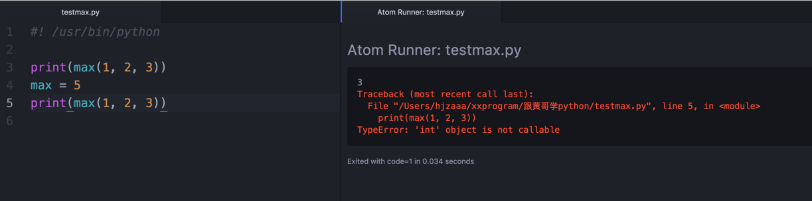
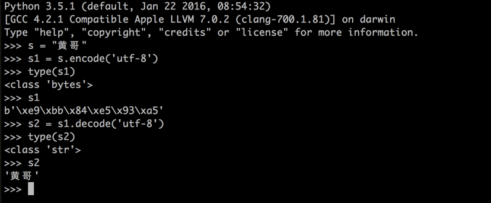
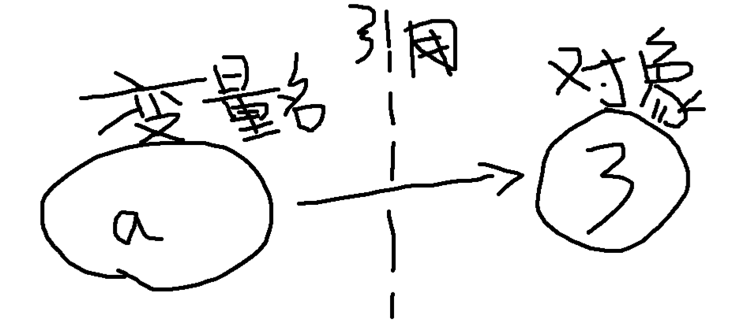

# 跟黄哥学习python第三章

# python 编程有多种范式    

	面向过程，面向对象，函数式编程，面向切面编程。
	编程范型或编程范式（英语：Programming paradigm），（范即模范之意，范式即模式、方法），是一类典型的编程风格，是指从事软件工程的一类典型的风格（可以对照方法学）。如：函数式编程、程序编程、面向对象编程、指令式编程等等为不同的编程范型。
	编程范型提供了（同时决定了）程序员对程序执行的看法。例如，在面向对象编程中，程序员认为程序是一系列相互作用的对象，而在函数式编程中一个程序会被看作是一个无状态的函数计算的序列。
	正如软件工程中不同的群体会提倡不同的“方法学”一样，不同的编程语言也会提倡不同的“编程范型”。一些语言是专门为某个特定的范型设计的（如Smalltalk和Java支持面向对象编程，而Haskell和Scheme则支持函数式编程），同时还有另一些语言支持多种范型（如Ruby、Common Lisp、Python和Oz）。
	很多编程范型已经被熟知他们禁止使用哪些技术，同时允许使用哪些。例如，纯粹的函数式编程不允许有副作用[1]；结构化编程不允许使用goto。可能是因为这个原因，新的范型常常被那些习惯于较早的风格的人认为是教条主义或过分严格。然而，这样避免某些技术反而更加证明了关于程序正确性——或仅仅是理解它的行为——的法则，而不用限制程序语言的一般性。
	编程范型和编程语言之间的关系可能十分复杂，由于一个编程语言可以支持多种范型。例如，C++设计时，支持过程化编程、面向对象编程以及泛型编程。然而，设计师和程序员们要考虑如何使用这些范型元素来构建一个程序。一个人可以用C++写出一个完全过程化的程序，另一个人也可以用C++写出一个纯粹的面向对象程序，甚至还有人可以写出杂揉了两种范型的程序。
	--来自维基百科

## 首先黄哥教初学者从面向过程编程范式训练起。

	面向过程编程程序设计（英语：Procedural programming），主要采取程序调用（procedure    call）或函数调用（function call）的方式来进行流程控制。   
	流程则由包涵一系列运算步骤的程序（Procedures），   
	例程（routines），子程序（subroutines）, 方法（methods），或函数（functions）来控制。   
	在程序运行的任何一个时间点，都可以调用某个特定的程序。   
	任何一个特定的程序，也能被任意一个程序或是它自己本身调用。  

## python 像人类讲的语言一样，有自己的语法。    

##python 变量。    
   变量    
   1、变量，望文生义一下，意思是说，可以改变，变化的量。程序设计中，希望可以改变的数据，用变量来保存或引用。
     变量在程序设计过程中，取值可以改变的量为变量。   
     变量一定要取一个有意义的名字，要用英文来取名字，不能用汉语拼音（不报语法错误，但不符合习惯），当你的代码
     在团队开发，国际交流中，人家老外看到用汉语拼音取的变量名会一头雾水。   
     有人说，英文不好，不学学啊，python不是不会吗，当你看到这段文字的时候，不是正在学习吗？

   2、python变量命名（常量、函数名、类名等）规则    
      (1)、第一个字母必须是字母或下划线(_),不能为数字。    
      (2)、除第一个字母外可以是字母或数字或下划线。    
      (3)、大小写敏感，意思是说，name,NAME 是不同的变量。    
      (4)、变量名使用小写字母，如果由2个以上单词构成的变量名，第一个单词为小写，后续的单词首字母都大写。
           numberOfComputer,这种命名方式就是骆驼式命名方式。也可以采用number_of_computer这种命名方式。     
      (5)、不能以python关键字或系统保留字为变量名。如果使用了关键字为变量名，造成原来的关键字被覆盖了。    
          
        >>> import keyword
		>>> keyword.kwlist
		['False', 'None', 'True', 'and', 'as', 'assert', 'break', 'class', 'continue', 'def', 'del', 'elif', 'else', 'except', 'finally', 'for', 'from', 'global', 'if', 'import', 'in', 'is', 'lambda', 'nonlocal', 'not', 'or', 'pass', 'raise', 'return', 'try', 'while', 'with', 'yield']
		例如：max(1, 2, 3) 这个max为内置函数，当你定义自己的变量名为max 时，再调用max(1, 2, 3)
        会报错。看下面的图。
   

   3、python是动态语言，变量不需要强制指定数据类型。    

     (1)、变量在它第一次赋值时创建。   
     (2)、变量在表达式中使用被替换为它们的值。   
     (3)、变量在表达式中使用之前必须先要赋值。（这个是初学者最容易犯的错误，经常变量没有先赋值就使用。有的初学者打字
     有误，造成变量名前后不一致，少一个字母或颠倒字母顺序或大小写等错误。    
     凡是报错信息看到“NameError: name '＊＊＊' is not defined”，就是这个问题。）

## 数据类型(数据类型是定义一个值的集合以及定义在这个值集上的一组操作。)
   python内置数据类型    
   (1)、布尔类型，有2个值True和False。

		这个最容易犯错的地方在于初学者，大小写写错，字母写错了。
		在python中一切非空值都为True,0值，None，空值，"",'',[],(),{}等都为False.
		布尔类型主要用在if 判断和 while循环语句中。

   (2)、数字类型  

       整型(int)，就是整数  

       复数(complex),Complex Numbers

       浮点型(float)（特别要注意是，计算机浮点数是近似计算，不能将2个浮点数用 == 判断相等。那怎么做，后面再表。）
		在计算机科学中，浮点（英语：Float point，缩写为FP）是一种对于实数的近似值数值表现法，由一个有效数字（即尾数）加上幂数来表示，通常是乘以某个基数的整数次指数得到。以这种表示法表示的数值，称为浮点数（floating-point number）。利用浮点进行运算，称为浮点计算，这种运算通常伴随着因为无法精确表示而进行的近似或舍入。
		这种表示方法类似于基数为10的科学记数法，在计算机上，通常使用2为基数的幂数来表式。一个浮点数a由两个数m和e来表示：a = m × be。在任意一个这样的系统中，我们选择一个基数b（记数系统的基）和精度p（即使用多少位来存储）。m（即尾数）是形如±d.ddd...ddd的p位数（每一位是一个介于0到b-1之间的整数，包括0和b-1）。如果m的第一位是非0整数，m称作正规化的。有一些描述使用一个单独的符号位（s 代表+或者-）来表示正负，这样m必须是正的。e是指数。
		这种表示法的设计，来自于对于值的表现范围，与精密度之间的取舍：可以在某个固定长度的存储空间内表示出某个实数的近似值。例如，一个指数范围为±4的4位十进制浮点数可以用来表示43210，4.321或0.0004321，但是没有足够的精度来表示432.123和43212.3（必须近似为432.1和43210）。当然，实际使用的位数通常远大于4。
		此外，浮点数表示法通常还包括一些特别的数值：+∞和−∞（正负无穷大）以及NaN（'Not a Number'）。无穷大用于数太大而无法表示的时候，NaN则指示非法操作或者无法定义的结果。
		其中，无穷大，可表示为inf，在内存中的值是，阶码为全1,尾数全0。而NaN则是阶码全1,尾数不全0。

(3)、系列（Sequences）

		字符串(str, unicode)
		str
		python2 中 represented as a sequence of 8-bit characters in Python 2.x
		python 3中 str as a sequence of Unicode characters (in the range of U+0000 - U+10FFFF) in Python 3.x
		python2 中，字符串有str, 和 unicode()类型。
		>>> s = "黄哥"
		>>> type(s)
		<type 'str'>
		>>> s2 = u"黄哥"
		>>> type(s2)
		<type 'unicode'>

		字节(bytes): only available in Python 3.x

		python 3中 str 和 bytes 互换，str调用encode()将字符串转换为字节。字节调用decode()转换为str.

       列表(list)（后面再表）

       集合(Sets) （后面再表）

		set: an unordered collection of unique objects; available as a standard type since Python 2.6
		frozen set: like set, but immutable (see below); available as a standard type since Python 2.6

	    字典（后面再表）

		dict: Python dictionaries, also called hashmaps or associative arrays, which means that an element of the list is associated with a definition, rather like a Map in Java

## 对象    

   python 里所有数据，布尔类型值、整数、浮点数、字符串、列表、元组、字典、函数、类等都是对象。
   python 变量是对对象的引用。（详细后面再讲）
 

[跟黄哥学习python第四章](learn_python_follow_brother_huang_4.md)

[点击黄哥python培训试看视频播放地址](https://github.com/pythonpeixun/article/blob/master/python_shiping.md)

[黄哥python远程视频培训班](https://github.com/pythonpeixun/article/blob/master/index.md)  

    