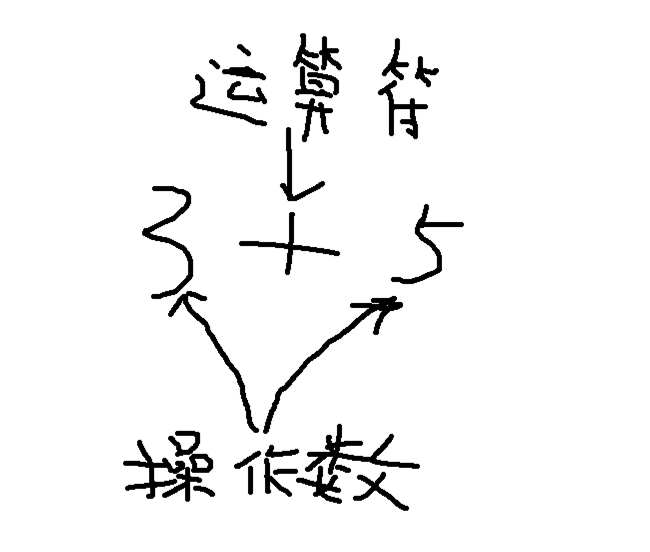

# 跟黄哥学习python第四章

# 表达式和语句（环境python 3.9）

黄哥箴言：过渡沉迷于语法，容易陷入钻牛角尖，学习编程要适当不求甚解一下。


## 表达式是值、变量和操作符（运算符）的组合。

单独的一个值是一个 表达式，单独的变量也是一个表达式。
表达式都有一个值，最简单的一个表达式为一个值，如3，3.9。
复杂的表达式由一些复杂的值和运算符组合起来的。
在python  if 语句中 if 后面跟单一变量，这个变量也是一个表达式。    
```
>>> n = 3
>>> if n:
...    print("n > 0")
...
n > 0
>>>
```

## 运算符是一种特殊的符号（如，+,-,*等）
   用来对一个值或多个数值的特殊运算。分算术运算符、关系(比较)运算符、
   逻辑(布尔)运算符

算术运算符    

	＋ 进行加法运算    
	>>> 3 + 5
	- 减法 35 － 20     
	* 乘法 3 ＊ 3     
	/ 除法 python 3 中 9 / 3 结果为 3.0 如果想和python 2 一样进行地板除(建议搜索一下何为地板除)，那么需要这样, 9 // 3    
	// 地板除 9 // 2 结果为4    
	** 幂运算 2 ＊＊ 3 结果为 8。
	相当于import math  math.pow(2, 3)。   
	% 取余或取模运算符，即求出除法后的余数。

   

## 算术表达式和运算符优先级  

	有如下表达式:
	(3 + 20 * x) / 2 - 12 * ((x + y) * 2) * (a + b)   
	计算顺序:   
	(1)、首先执行括号内的运算符，括号内还可以有括号，内层括号内的表达式优先被执行。   
	(2)、第二，计算幂运算(**)。   
	(3)、第三，计算乘法(*)，除法(/)，整除(//),求余运算(％)，如果一个表达式中包含多个乘法、除法、
	     和求余运算，它们从左到右运算。    
	(4)、最后计算加法(+) 和减法。如果一个表达式中包含多个加法和减法，它们从左到右运算。    


## 语句   
   Python语句是一段可执行代码。常见的有赋值语句，if 语句， while 语句，for 语句，return, import 语句等等。

	>>> x = 3 # 赋值语句
	>>> y = 3
	>>> id(x)
	4329842800
	>>> id(y)
	4329842800
	>>> type(y)
	<class 'int'>
	>>> y
	3
	>>> x
	3

赋值语句 x = 3 是这样理解的，内存中为对象3，分配一段内存地址，将整型对象3的引用赋值给x。
x中保存对象3的引用。可以用type()函数,取得变量x引用的对象的类型。
id()函数取得变量x引用的对象的内存地址。
常用id()取得的地址是不是相同，来判断不同的变量是不是对同一个对象的引用。
print(x) 可以输出变量x引用对象的值。
至于语言是怎么设计的，就需要不求甚解一下。    

总结一下：对象有3个属性，身份，用id()取得；类型，用type()取得，值，print()输出取得。

## 多种赋值语句的形式

- 增量赋值
```
	x = x + 1 可以写成 x += 1
	其它的类似有： -= *= /= %= **= 等。
```
- 多重赋值
```
>>> x = y = z = 1
>>> x
1
>>> y
1
>>> z
1
```
- 多元赋值
```
>>> x, y, z = 1, 2, "黄哥"
>>> x
1
>>> y
2
>>> z
'黄哥'
```

# Python 语句特征    
```
# 表示之后的字符为注释，不被执行。  
一行代码超过80个字符，可以用反斜杠(\) 续行。  
冒号(:) 表示下一行或多行要缩进4个空格的语句块（复合语句）。  
语句块用不同的缩进来表示。  
python 文件以模块的形式来组织。
```  


如果你感觉黄哥的文章对你有帮助请打赏，支付宝账号：18610508486@163.com

[跟黄哥学习python第五章](learn_python_follow_brother_huang_5.md)


[点击黄哥python培训试看视频播放地址](https://github.com/pythonpeixun/article/blob/master/python_shiping.md)

[黄哥python远程视频培训班](https://github.com/pythonpeixun/article/blob/master/index.md)  


​    