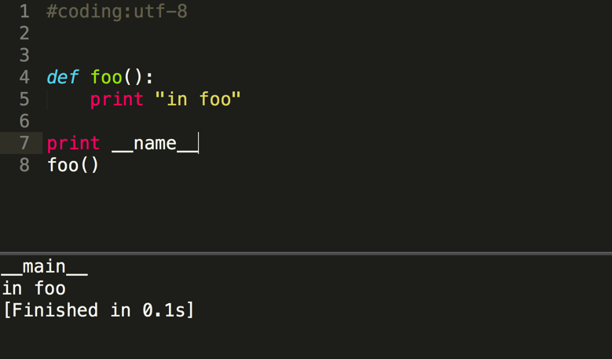
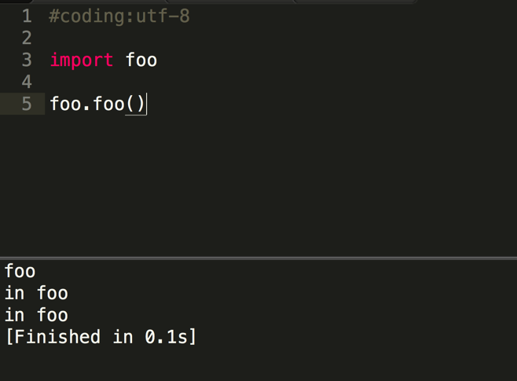
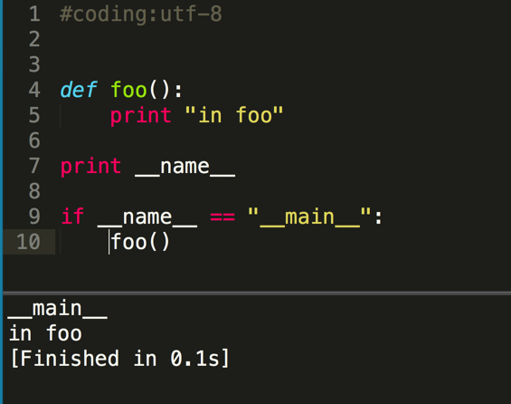
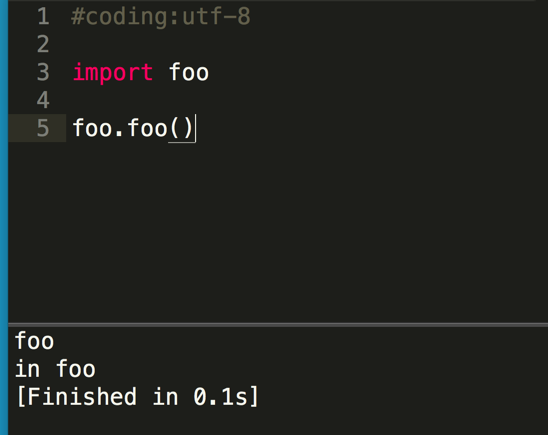

#这样理解python中的if __name__ == '__main__':

如果你感觉黄哥的文章对你有帮助请打赏，支付宝账号：18610508486@163.com

 用图片说明python中的if __name__ == '__main__':  

 模块都有一个变量__name__,可以在模块中print __name__的值看来本模块独立执行的值为__main__,  

 被其它模块导入执行的值为该模块(foo.py)的名字foo.  

 if语句有2个作用：  

 1、可以在这个if下测试函数或类。  

 2、防止模块被导入时，函数或类的代码被执行2次。  

 
 
 
 

[点击黄哥python培训试看视频播放地址](https://github.com/pythonpeixun/article/blob/master/python_shiping.md)

[黄哥python远程视频培训班] (https://github.com/pythonpeixun/article/blob/master/index.md)
