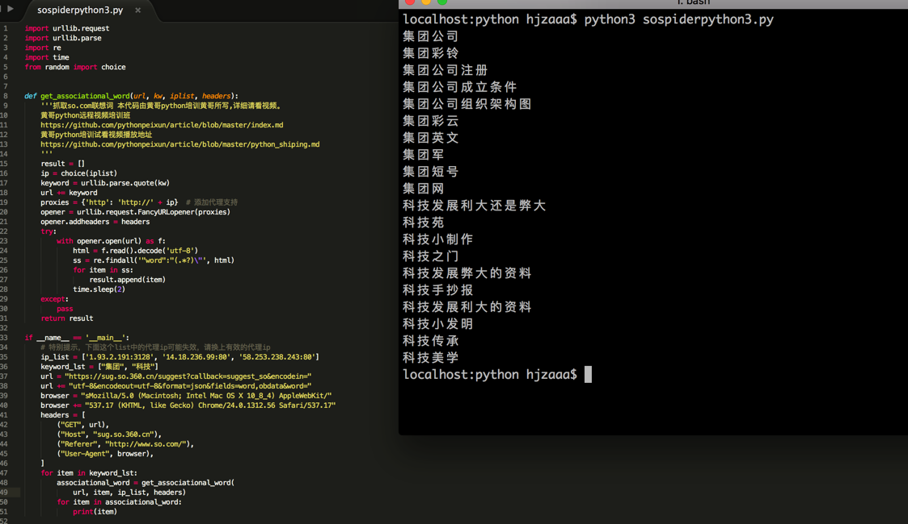

# python爬虫联想词视频中的代码

黄哥讲的python爬虫联想词视频得到很多人的喜欢，感谢大家的支持!
[点击播放](http://www.tudou.com/programs/view/SXgshk-sYbw/)

# 视频中的代码(python 2)   

		# coding:utf-8
		"""
		本代码由黄哥python培训黄哥所写,详细请看视频。
		 
		"""
		import urllib2
		import urllib
		import re
		import time
		from random import choice
		#特别提示，下面这个list中的代理ip可能失效，请换上有效的代理ip
		iplist  = ['27.24.158.153:81','46.209.70.74:8080','60.29.255.88:8888']
		 
		list1 = ["集团","科技"]
		for item in list1:
		    ip= choice(iplist)
		    gjc = urllib.quote(item)
		    url = "http://sug.so.360.cn/suggest/word?callback=suggest_so&encodein=utf-8&encodeout=utf-8&word="+gjc
		    headers = {
		                "GET":url,
		                "Host":"sug.so.360.cn",
		                "Referer":"http://www.so.com/",
		                "User-Agent":"sMozilla/5.0 (Macintosh; Intel Mac OS X 10_8_4) AppleWebKit/537.17 (KHTML, like Gecko) Chrome/24.0.1312.56 Safari/537.17",
		                }
		 
		    proxy_support = urllib2.ProxyHandler({'http':'http://'+ip})
		 
		    opener = urllib2.build_opener(proxy_support)
		    urllib2.install_opener( opener )
		    req = urllib2.Request(url)
		     
		    for key in headers:
		        req.add_header(key,headers[key])
		 
		    html = urllib2.urlopen(req).read()
		     
		    ss = re.findall("\"(.*?)\"",html)
		    for item in ss:
		        print item
		    time.sleep(2)

# python爬虫联想词 python 3.5 代码，修改于2016-5-9 上午，北京。   

		import urllib.request
		import urllib.parse
		import re
		import time
		from random import choice

		def get_associational_word(url, kw, iplist, headers):
		    '''抓取so.com联想词 本代码由黄哥python培训黄哥所写,详细请看视频。
		    黄哥python远程视频培训班
		    https://github.com/pythonpeixun/article/blob/master/index.md
		    黄哥python培训试看视频播放地址
		    https://github.com/pythonpeixun/article/blob/master/python_shiping.md
		    '''
		    result = []
		    ip = choice(iplist)
		    keyword = urllib.parse.quote(kw)
		    url += keyword
		    proxies = {'http': 'http://' + ip}  # 添加代理支持
		    opener = urllib.request.FancyURLopener(proxies)
		    opener.addheaders = headers
		    try:
		        with opener.open(url) as f:
		            html = f.read().decode('utf-8')
		            ss = re.findall('"word":"(.*?)\"', html)
		            for item in ss:
		                result.append(item)
		            time.sleep(2)
		    except:
		        pass
		    return result

		if __name__ == '__main__':
		    # 特别提示，下面这个list中的代理ip可能失效，请换上有效的代理ip
		    ip_list = ['1.93.2.191:3128', '14.18.236.99:80', '58.253.238.243:80']
		    keyword_lst = ["集团", "科技"]
		    url = "https://sug.so.360.cn/suggest?callback=suggest_so&encodein="
		    url += "utf-8&encodeout=utf-8&format=json&fields=word,obdata&word="
		    browser = "sMozilla/5.0 (Macintosh; Intel Mac OS X 10_8_4) AppleWebKit/"
		    browser += "537.17 (KHTML, like Gecko) Chrome/24.0.1312.56 Safari/537.17"
		    headers = [
		        ("GET", url),
		        ("Host", "sug.so.360.cn"),
		        ("Referer", "http://www.so.com/"),
		        ("User-Agent", browser),
		    ]
		    for item in keyword_lst:
		        associational_word = get_associational_word(
		            url, item, ip_list, headers)
		        for item in associational_word:
		            print(item)

[黄哥python远程视频培训班](https://github.com/pythonpeixun/article/blob/master/index.md)
[点击黄哥python培训试看视频播放地址](https://github.com/pythonpeixun/article/blob/master/python_shiping.md)

