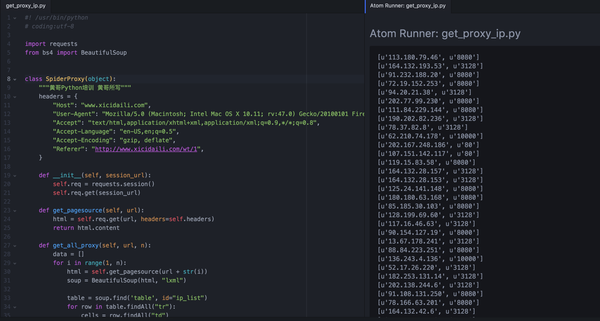

# 跟黄哥学Python爬虫抓取代理IP

为了防止被反爬虫策略禁止访问，有的时候需要用到代理IP，代理IP可以到一些提供
代理IP的网站上爬取，也可以自己扫描。（想想这些提供代理IP的网站是怎么得到这些代理IP的，是通过扫描得来的）。

下面的代码用到requests和BeautifulSoup，到一个网站上采集IP，为了初学者学习方便，只取前面10页的内容，

请大家修改代码。

		# coding:utf-8

		import requests
		from bs4 import BeautifulSoup

		class SpiderProxy(object):
		    """黄哥Python培训 黄哥所写 Python版本为2.7以上"""
		    headers = {
		        "Host": "www.xicidaili.com",
		        "User-Agent": "Mozilla/5.0 (Macintosh; Intel Mac OS X 10.11; rv:47.0) Gecko/20100101 Firefox/47.0",
		        "Accept": "text/html,application/xhtml+xml,application/xml;q=0.9,*/*;q=0.8",
		        "Accept-Language": "en-US,en;q=0.5",
		        "Accept-Encoding": "gzip, deflate",
		        "Referer": "http://www.xicidaili.com/wt/1",
		    }

		    def __init__(self, session_url):
		        self.req = requests.session()
		        self.req.get(session_url)

		    def get_pagesource(self, url):
		        html = self.req.get(url, headers=self.headers)
		        return html.content

		    def get_all_proxy(self, url, n):
		        data = []
		        for i in range(1, n):
		            html = self.get_pagesource(url + str(i))
		            soup = BeautifulSoup(html, "lxml")

		            table = soup.find('table', id="ip_list")
		            for row in table.findAll("tr"):
		                cells = row.findAll("td")
		                tmp = []
		                for item in cells:

		                    tmp.append(item.find(text=True))
		                data.append(tmp[1:3])
		        return data

		session_url = 'http://www.xicidaili.com/wt/1'
		url = 'http://www.xicidaili.com/wt/'
		p = SpiderProxy(session_url)
		proxy_ip = p.get_all_proxy(url, 10)
		for item in proxy_ip:
		    if item:
		        print item

建议： 为了保持代理IP可用，需要创建一个代理池，定期检测可用的代理，无效的代理及时删除。可以用redis实现。

[216小时学会Python](https://github.com/pythonpeixun/article/blob/master/python/hours_216.md)

[感恩！感谢黄哥Python培训学员的支持和肯定。](https://github.com/pythonpeixun/article/blob/master/python/thanks.md)
