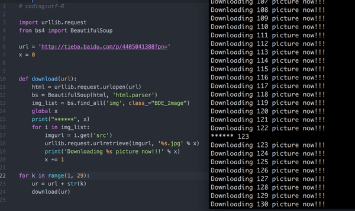

# Python 爬虫代码重构

回答这个问题https://www.zhihu.com/question/49000755

下面的代码用到了全局变量，不是很好的习惯。（Python 3）
下面的爬虫代码有一个致命的问题（没有模拟人工访问），请大家添加。

黄哥重构一下代码，请大家参考。

	# coding:utf-8

	import urllib.request
	from bs4 import BeautifulSoup

	url = 'http://tieba.baidu.com/p/4405041388?pn='

	def download(url):
	    html = urllib.request.urlopen(url)
	    bs = BeautifulSoup(html, 'html.parser')
	    img_list = bs.find_all('img', class_="BDE_Image")

	    for i in img_list:
	        imgurl = i.get('src')
	        yield imgurl

	def main(n):
	    imgurls = []
	    for k in range(1, n):
	        ur = url + str(k)
	        try:
	            imgurls.extend(list(download(ur)))
	        except Exception as e:
	            pass

	    for i, imgurl in enumerate(imgurls):
	        try:
	            urllib.request.urlretrieve(imgurl, '%s.jpg' % i)
	            print('Downloading %s picture now!!!' % i)
	        except Exception as e:
	            pass

	if __name__ == '__main__':
	    main(5)

再次重构

		# coding:utf-8

		import urllib.request
		from bs4 import BeautifulSoup

		url = 'http://tieba.baidu.com/p/4405041388?pn='

		def download(url):
		    html = urllib.request.urlopen(url)
		    bs = BeautifulSoup(html, 'html.parser')
		    img_list = bs.find_all('img', class_="BDE_Image")

		    for i in img_list:
		        imgurl = i.get('src')
		        yield imgurl

		def get_all_image(n):
		    imgurls = []
		    for k in range(1, n):
		        ur = url + str(k)
		        try:
		            imgurls.extend(list(download(ur)))
		        except Exception as e:
		            pass
		    return imgurls

		def save_img_to_file(n):
		    imgurls = get_all_image(n)
		    for i, imgurl in enumerate(imgurls):
		        try:
		            urllib.request.urlretrieve(imgurl, '%s.jpg' % i)
		            print('Downloading %s picture now!!!' % i)
		        except Exception as e:
		            pass

		if __name__ == '__main__':
		    save_img_to_file(5)

[216小时学会Python](https://github.com/pythonpeixun/article/blob/master/python/hours_216.md)