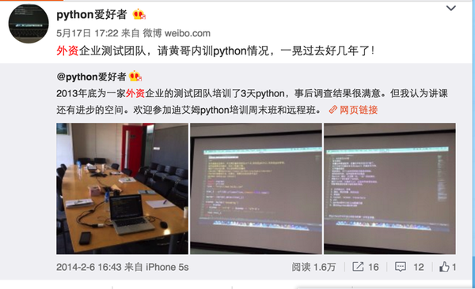

# 程序员外出讲课怎样才能算成功。

黄哥有幸被多家企业请去面授Python。下面分享一下如何成功的完成讲课任务。   
1、讲课前一定要充分的沟通，参加听课的背景，是有Java经验，还是有c/c++开发经验，

还是毫无经验。业务是程序开发，是测试，还是数据分析。也就是说需求要搞清楚。

参加听课的学员，如果需求不分，这个课就会讲得不顺利。

2、讲课只需一个大纲，不需要所有的用PPT，黄哥习惯边敲代码，边讲课。   

3、授课时，要照顾大多数人的情况，特别是有50人以上听课的情况，有的基础好，有的基础差，有的有c语言基础，有的有R基础，所谓众口难调，但讲课时照顾大多数的情况，这个讲课会是成功的。

4、讲课时要谦虚，不要只顾埋头讲课，要时不时看看大家的表情。要让听课者积极参加互动。    

5、一般授课2到3天，成功与否，有一个调查表，满意度85%以上才能拿到报酬。这个很重要，能不能顺利拿到劳动报酬也是衡量讲课是不是成功重要的标志。

6、黄哥顺利为多家企业面授，都顺利拿到劳动报酬。      

[感恩！感谢黄哥Python培训学员的支持和肯定。](https://github.com/pythonpeixun/article/blob/master/python/thanks.md)

[216小时学会Python](https://github.com/pythonpeixun/article/blob/master/python/hours_216.mdown)