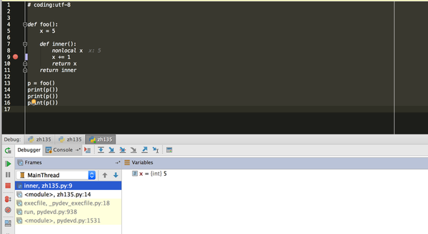
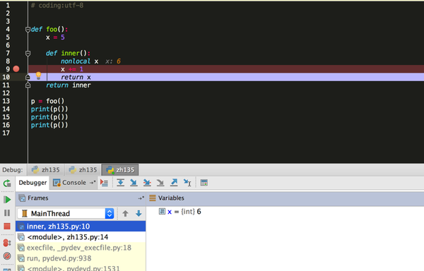
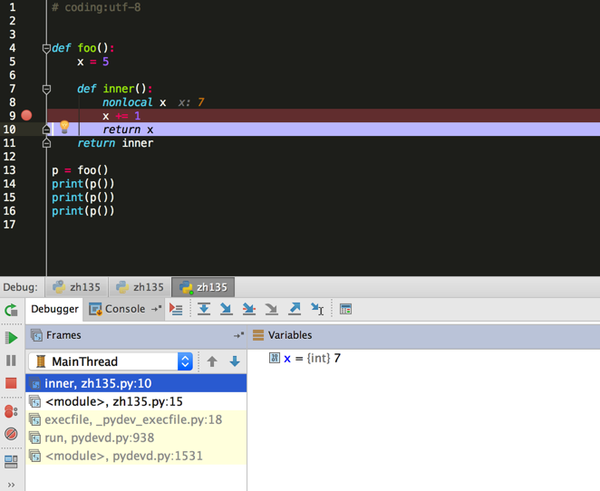
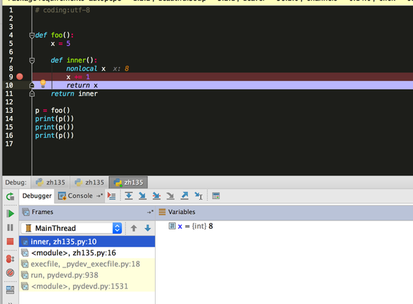

# 黄哥漫谈Python 闭包

在计算机科学中，闭包（英语：Closure），又称词法闭包（Lexical Closure）或函数闭包（function closures），是引用了自由变量的函数。这个被引用的自由变量将和这个函数一同存在，即使已经离开了创造它的环境也不例外。所以，有另一种说法认为闭包是由函数和与其相关的引用环境组合而成的实体。闭包在运行时可以有多个实例，不同的引用环境和相同的函数组合可以产生不同的实例。

在函数中可以（嵌套）定义另一个函数时，如果内部的函数引用了外部的函数的变量，则可能产生闭包。运行时，一旦外部的 函数被执行，一个闭包就形成了，闭包中包含了内部函数的代码，以及所需外部函数中的变量的引用。其中所引用的变量称作上值(upvalue)。

Python 中通俗一点来说，如果在一个函数内部，嵌套了函数，这个内部函数对（非全局作用域）外部作用域的变量进行引用，那么这个内部函数称为闭包。闭包每次运行是能记住引用的外部作用域的变量的值。

理解下面这个代码，函数返回值为函数，Python 函数为第一类对象，可以赋值给变量，可以作为参数传递，可以从函数中返回。

被返回的函数为闭包。nonlocal 为Python 3的语法，表示非局部变量。

下面的代码，是回答这个https://www.zhihu.com/question/48735888 问题。

			# coding:utf-8

			def foo():
			    x = 5

			    def inner():
			        nonlocal x
			        x += 1
			        return x
			return inner

			p = foo()
			print(p())
			print(p())
			print(p())

可以从单步调试来观看x值的变化。

    

闭包作用：

可以用来编写惰性求值的代码，可以用在函数调用时保持特定状态。

装饰器中要用到闭包。

一个对Python初学者难以理解的作用域代码

https://zhuanlan.zhihu.com/p/21528317

[216小时学会Python](https://github.com/pythonpeixun/article/blob/master/python/hours_216.md)

[感恩！感谢黄哥Python培训学员的支持和肯定。](https://github.com/pythonpeixun/article/blob/master/python/thanks.md)
