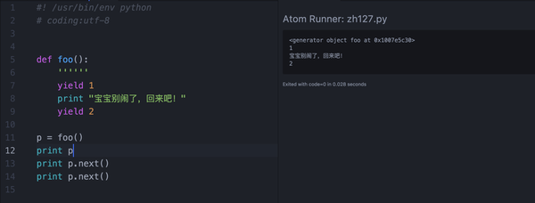
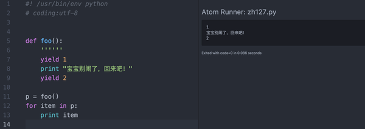
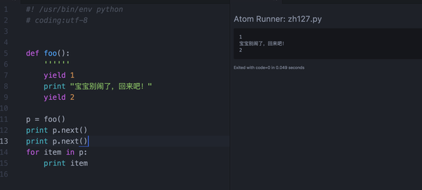
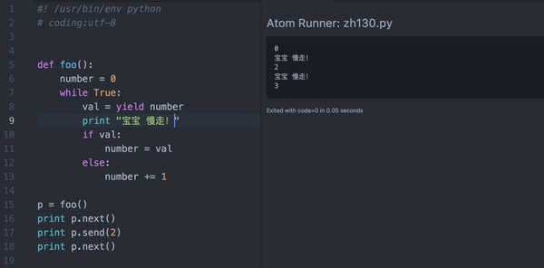

# 黄哥漫谈Python 生成器

何为生成器（Generators）
下面的黄哥用大白话说明。
当Python 函数不用return 返回值，用yield关键字的时候，函数的返回值为生成器对象。   

图中代码，函数没有用return 返回值，用yield 输出值，函数的调用返回值为生成器对象，
生成器对象，用p.next()方法返回一个值，函数执行暂停，下次再调用next()方法时，从
暂停处开始执行，print 输出值。再执行第二个yield 返回值。

像上面函数的返回值为生成器对象的函数叫做生成器函数。

生成器是一个可迭代对象，可以用for循环迭代。   

特别需要注意的是，初学者容易出现的一个错误是，生成器用next()方法，到最后一个yield
返回值时，再用一次，会报错误StopIteration。

下面图片中p是生成器，用了二次next()方法，相当于返回值都返回完了，再循环迭代没有输出。见过初学者一直问为啥这样，黄哥说“你可以想像成指针”前面已经指到尾部了。所以

for 循环 没有输出。    

增强的生成器，有send()和close()方法。

增强的生成器中，除yield可以输出值，也可以从外部send值到生成器内部。这个时候，yield 是表达式，可以输出值，也可以接收值赋值给其他变量。

有近一步学习的，请看

PEP 342 -- Coroutines via Enhanced Generators

https://www.python.org/dev/peps/pep-0342/

## 下面讲讲生成器实例代码。

1、利用生成器生成可以无限取值的斐波拉切函数。

		#!/usr/bin/env python
		# -*- coding: utf-8 -*-
		# Author: 黄哥python培训 qq:1465376564

		def fib():
		    a, b = 0, 1
		    while True:
		        yield a
		        a, b = b, a + b

		p = fib()
		print [p.next() for i in xrange(101)]

2、求PI值。

		#!/usr/bin/env python
		# -*- coding: utf-8 -*-
		# Author: 黄哥python培训 qq:1465376564
		"""
		1 - 1/3 + 1/5 - 1/7 + ...

		"""

		def pi_series():
		    total = 0
		    i = 1.0
		    j = 1
		    while True:
		        total = total + j / i
		        yield 4 * total
		        i += 2
		        j = j * -1

		def main(g, n):
			for i in range(n):
				yield g.next()

		if __name__ == '__main__':
		    print list(main(pi_series(), 8))

		#[4.0, 2.666666666666667, 3.466666666666667, 2.8952380952380956, 3.3396825396825403, 2.9760461760461765, 3.2837384837384844, 3.017071817071818]

3、生成器处理大日志文本文本。

			# coding:utf-8

			import time
			start_time = time.time()

			def find_ip(path):
			    for line in open(path):
			        s = line.find('"Sogou web spider')
			        if s >= 0:
			            yield line[:s].strip()

			p = find_ip("bigfile.txt")
			p = list(set(list(p)))
			for item in p:
			    print item

			print time.time() - start_time, "seconds"

4、生成器函数也可以玩递归。   

			#!/usr/bin/env python
			# -*- coding: utf-8 -*-
			# Author: 黄哥python培训 qq:1465376564

			def spread_list(lst):
			    tmp = []
			    for item in lst:
			        if isinstance(item, list):
			            tmp = spread_list(item)
			            for item2 in tmp:
			                yield item2
			        else:
			            yield item

			l = [1, 2, 3, 4, 5, [6], [7, 8, [9, [10]]]]
			l2 = [[3, 7, [9, 6]], [2, [3, 4], 10], 99, 28]
			l3 = []
			l4 = [3, 4, 5, 8]
			lst = spread_list(l)
			print list(lst)
			lst = spread_list(l2)
			print list(lst)
			lst = spread_list(l3)
			print list(lst)
			lst = spread_list(l4)
			print list(lst)

			# [1, 2, 3, 4, 5, 6, 7, 8, 9, 10]
			# [3, 7, 9, 6, 2, 3, 4, 10, 99, 28]
			# []
			# [3, 4, 5, 8]

[如何训练自己的编程思路](https://github.com/pythonpeixun/article/blob/master/python/how_to_learn_program2.md)

[部分免费Python免费视频](https://github.com/pythonpeixun/article/blob/master/python_shiping.md)

[感恩！感谢黄哥Python培训学员的支持和肯定](https://zhuanlan.zhihu.com/p/21548489?refer=pythonpx)