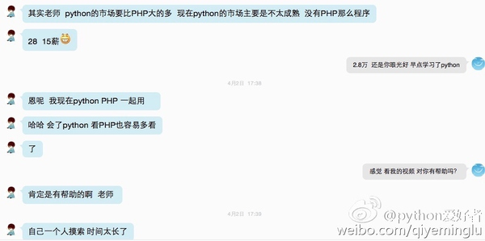

# 感恩！感谢黄哥Python培训学员的支持和肯定。

学习Python是很多非科班出生的IT人士的最优选择之一。
如运维、测试等IT人士，如果不学习Python，路会越走越窄。所以有的通过自学完成升级，有的没有自学能力，参加了黄哥Python培训，完成从不会写代码到自己能写代码解决问题的转变。

感谢一些学员的支持和肯定。他们走过的路，你也可以模仿。

1、年薪42万的运维学员。

2、东北学员评价

3、女测试学员对视频的评价

4、测试学员的评价

5、海外学员的评价

6、外资企业请黄哥讲课的情况。

学习千万不能“好高骛远”，有少部分人说Python语法都知道，可惜，让他写做一个习题，代码写不出。让他做一个项目，像狗咬刺猬无从下手。

希望大家脚踏实地的认真学习。

[参加黄哥python远程视频培训,帮你完成从不会写代码到会写代码解决问题的过渡。](https://github.com/pythonpeixun/article/blob/master/index.md)

咨询qq:1465376564

